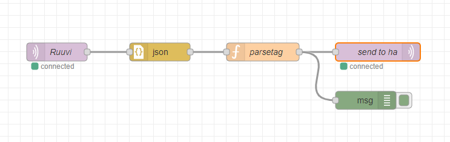

# ruuvigw_node-red_ha
Ruuvi gateway to home-assistant using mqtt.

## Short ##

Parse ruuvi gateway messages and create home-assistant config, state and status messages.

Copy and paste the code from parsetags.js to function node and edit the tagnames.

A new option "tagsAsDevices" to show each tag as individual device instead of all under one single "ruuviGW". Makes using the values in ha a bit simpler.

Optionally you can copy the whole flow from 

## Long ##

### MQTT Broker and Node-Red ###

You need to have a MQTT broker and Node-Red running in your network. Either in own server or same as home-assistant. Easiest is to add it from add-on store using Supervisor 

If you use Mosquitto in same machine as Home-assistant, you should create a user into home-assistant which can be used as a Mosquitto user.

Create a flow into node-red. You can copy content of  into clipboard and import that directly to a node-red flow. You ned to specify the mqtt broker info. After you have done it deploy your flow.

### MQTT Integration ###

If you do not yet have mqtt integration in use in home-assistant then  

After this you should find your **ruuviGW** device under MQTT integration.
